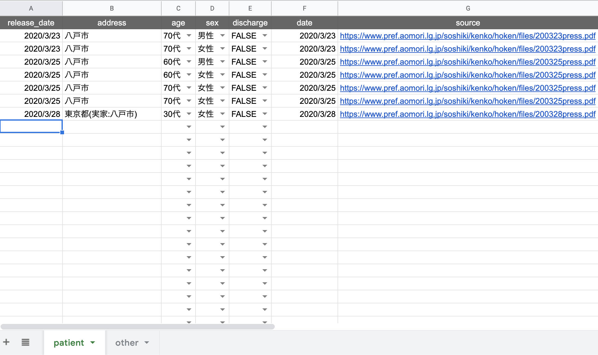
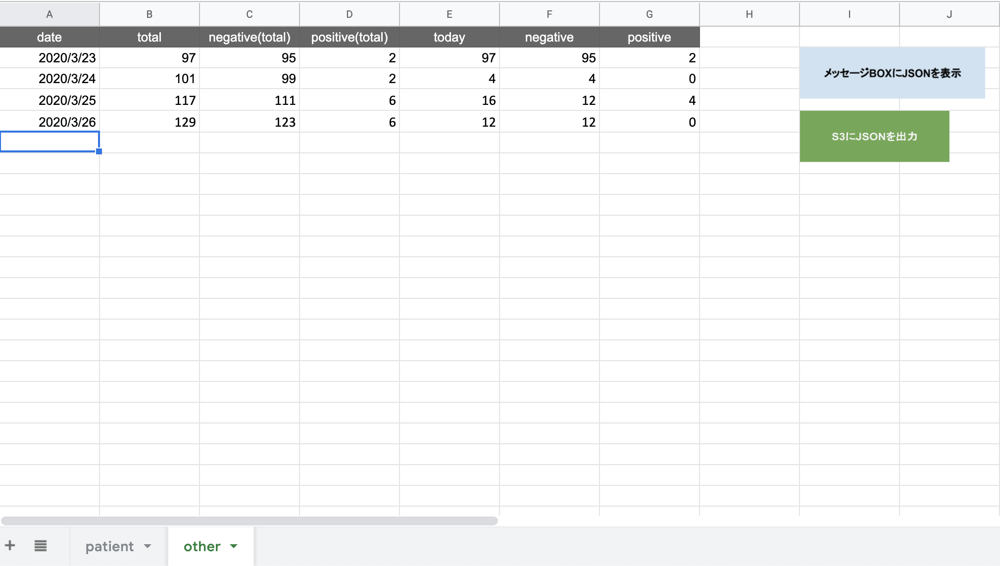
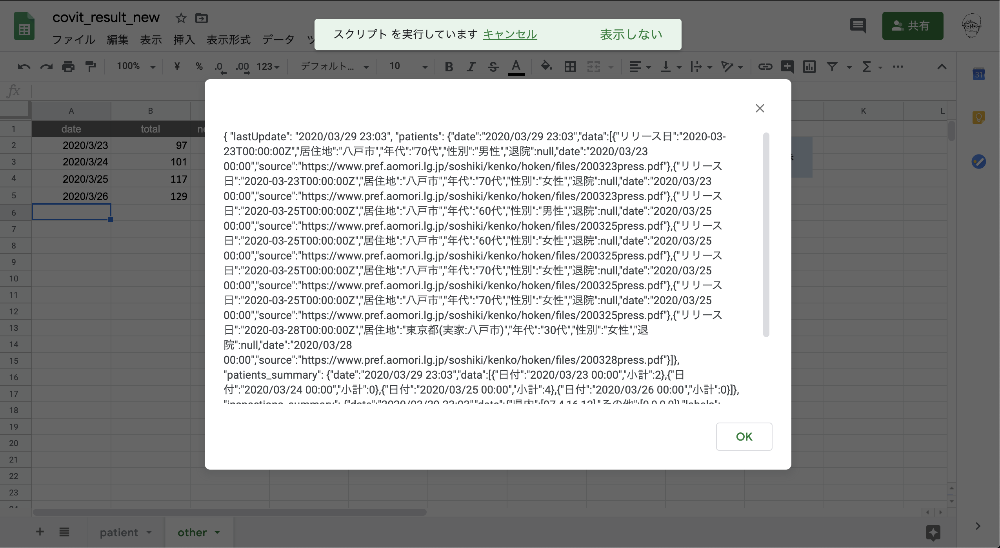
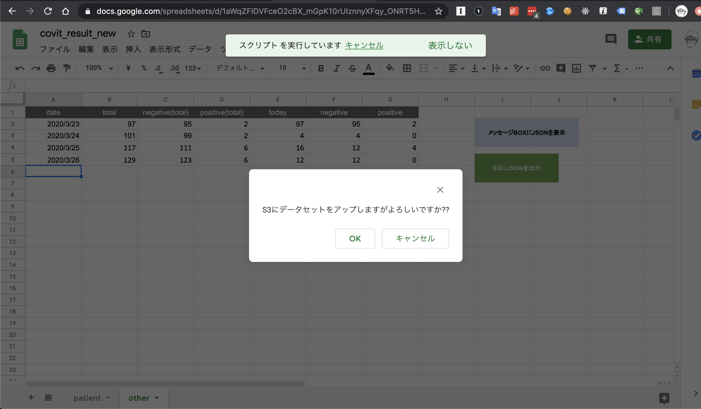

# gas-datasetgen

## データセット管理スプレッドシート
https://bit.ly/2JpNd74

※ 権限が必要な方は `@fukuiretu` まで別途ご連絡してください

## データセット反映手順
### 1. 陽性患者の属性を反映する
データセット管理スプレッドシート.patientシートを編集する

### 2. 陽性患者数, 検査実施件数を反映する
データセット管理スプレッドシート.otherシートを編集する

### 3. データセットのJSONを確認する
データセット管理スプレッドシート.otherシートにある**メッセージBOXをJSONに表示**を押下する

### 4. データセットを本番環境に反映する
データセット管理スプレッドシート.otherシートにある**S3にJSONを出力**を押下する

